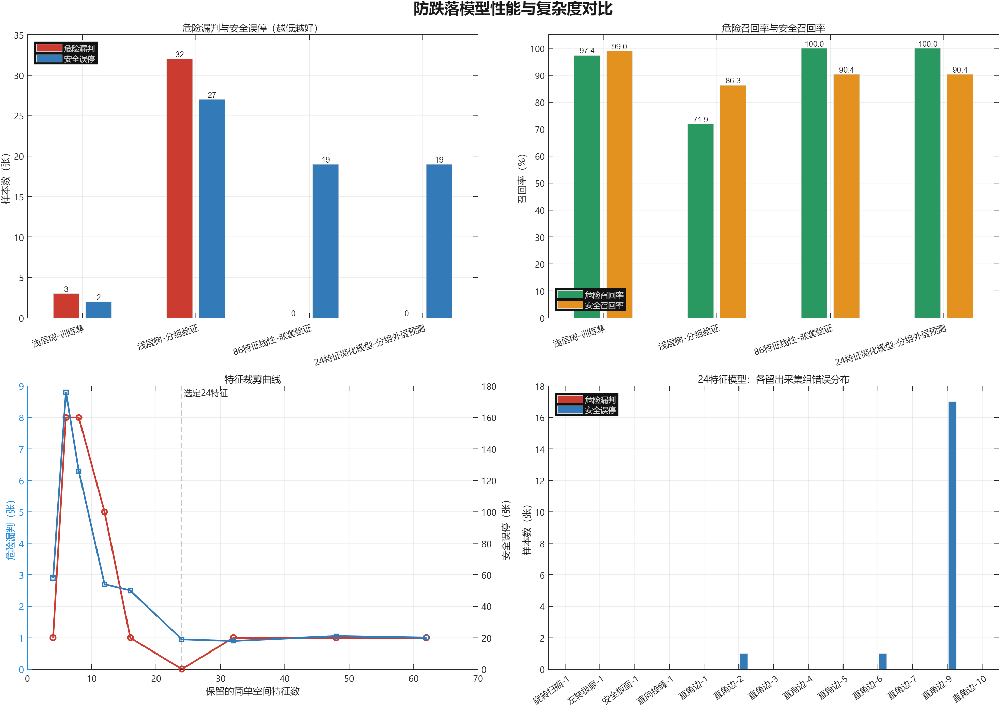
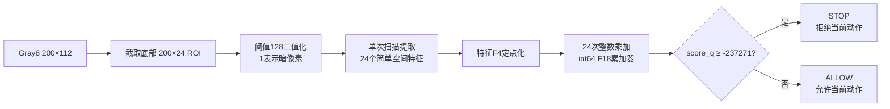
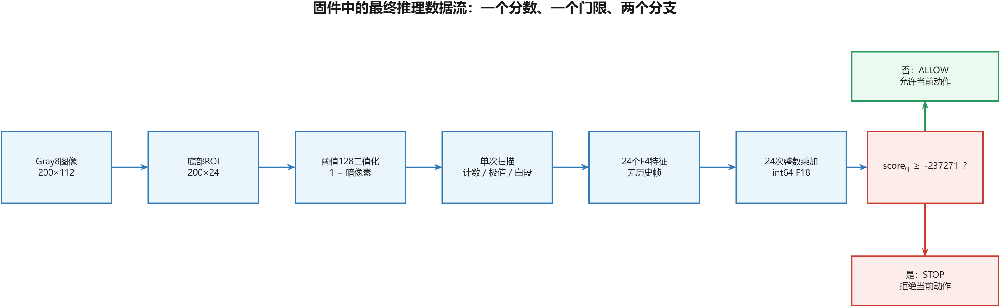
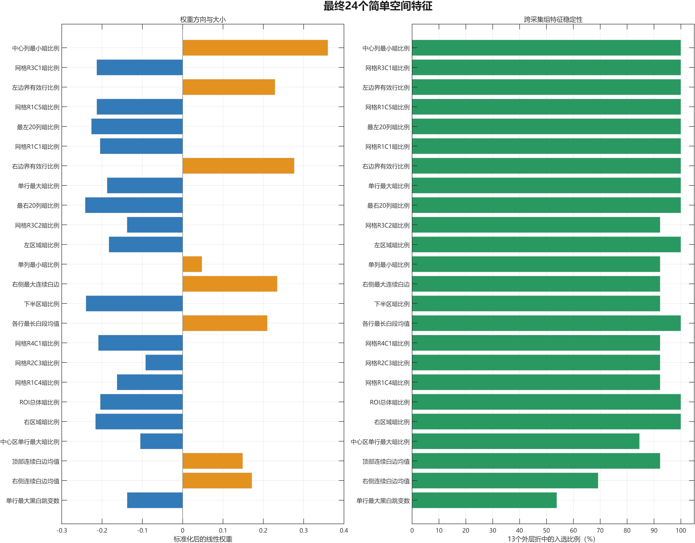
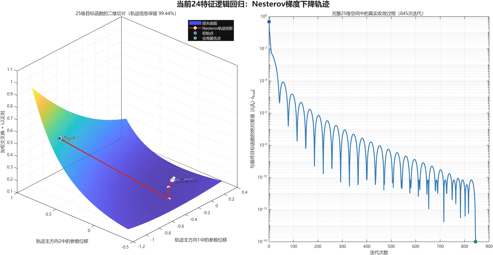
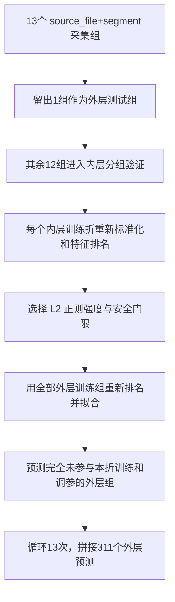
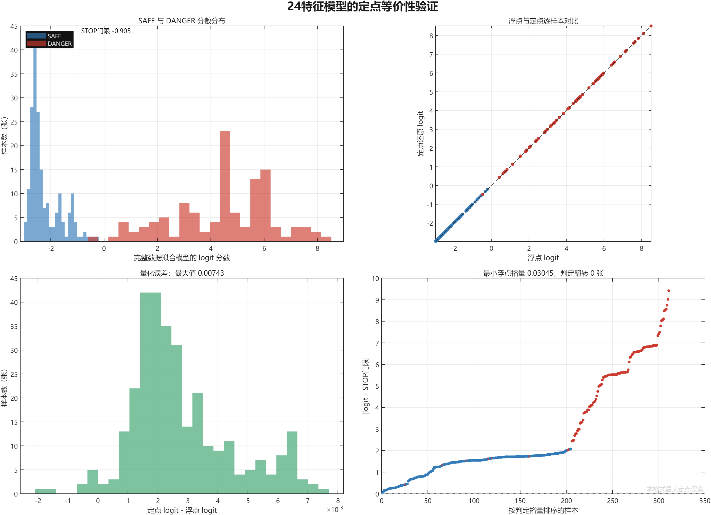

# Vehicle 防跌落模型原理、训练与测试报告

## 1. 先给结论

最终候选不是神经网络，也不是类似 YOLO 的实时检测网络喵。

它是一个传统监督式机器学习模型，准确名称是“带 L2 正则化的二分类逻辑回归危险评分器”喵。

模型在 MATLAB 中离线训练，固件运行时权重保持不变，只执行 24 个简单空间特征的提取、24 次整数乘加和 1 次门限比较喵。

当前严格分组结果为 `TD=114、MD=0、FD=19、TS=178`，危险召回率为 `100%`，安全召回率为 `90.36%`，平衡准确率为 `95.18%` 喵。

这说明当前已有采集组中没有危险漏判，但不能证明未来所有新光照、姿态和地面条件下都一定零漏判喵。



## 2. 它属于哪一类模型

| 问题 | 本模型的归类 |
|---|---|
| 是否是传统 ML | 是 |
| 是否是监督式 ML | 是，使用人工 `SAFE/DANGER` 标签 |
| 是否是神经网络 | 否 |
| 是否类似 YOLO | 否 |
| 是否使用预训练模型 | 否，从当前数据直接训练 |
| 是否在线学习 | 否，固件运行时不更新权重 |
| 是否能实时运行 | 能，实时只表示推理速度足够，不表示在线训练 |
| 是否需要 NPU | 否，M33 或 M85 CPU 即可完成 |
| 是否属于 PTQ | 广义上做了训练后定点化，但不是神经网络/NPU 工具链中的 PTQ |
| 部署时是否计算 sigmoid | 否，只比较线性 logit 与门限 |

YOLO 通常包含大量卷积层、激活函数、特征金字塔和检测头，参数量与乘加次数很大，适合交给 Ethos-U55 等加速器喵。

本模型没有卷积层和隐藏层，最终只有一个线性加权和，因此不需要第二个神经网络运行时喵。

## 3. 最终推理结构





这里没有决策树意义上的多个节点，也没有神经网络意义上的层和神经元喵。

24 个特征是 24 个输入量，全部汇入一个线性评分节点，最后只有一个 `STOP/ALLOW` 条件分支喵。

旧浅层 CART 树有 9 个节点，但分组验证出现 32 个危险漏判，因此已经淘汰喵。

## 4. 输入特征是什么

最终 24 个特征全部来自底部 `200×24` 二值 ROI 喵。

它们只包含以下容易用整数计算的量喵。

- ROI、左区、右区、上下半区和固定网格的暗像素比例喵。
- 单行或单列暗像素比例的极值喵。
- 左右边界是否存在部分白边的有效行比例喵。
- 每行最长连续白段及右侧、顶部连续白边统计喵。
- 单行黑白跳变次数的最大值喵。

最终模型不使用历史帧、时间变化率、协方差、质心、标准差、直线拟合、拟合残差或平方根喵。



权重正负不能简单解释成“正数特征一定危险、负数特征一定安全”喵。

原因是多个图像特征存在相关性，单个权重描述的是“其他特征固定时，该特征增加对总分的边际影响”喵。

## 5. 数学模型

### 5.1 标签

令第 $i$ 张图的标签为喵。

$$
y_i =
\begin{cases}
1, & \text{DANGER} \\
0, & \text{SAFE}
\end{cases}
$$

### 5.2 训练时标准化

训练折中的第 $j$ 个特征使用该训练折自己的均值和标准差进行标准化喵。

$$
z_{ij}=\frac{x_{ij}-\mu_j}{\sigma_j}
$$

验证组不参与计算 $\mu_j$ 和 $\sigma_j$，否则会发生数据泄漏喵。

### 5.3 线性危险分数

模型先计算 logit 线性分数喵。

$$
s_i=b+\sum_{j=1}^{K}w_jz_{ij}
$$

其中 $K=24$，$b$ 是截距，$w_j$ 是第 $j$ 个特征的权重喵。

训练时通过 sigmoid 把 logit 映射为危险概率喵。

$$
p_i=\sigma(s_i)=\frac{1}{1+e^{-s_i}}
$$

sigmoid 是单调函数，所以部署时不必计算指数函数喵。

概率门限 $p_i\ge t$ 可以严格改写为 logit 门限喵。

$$
s_i\ge \log\frac{t}{1-t}
$$

### 5.4 加权交叉熵与 L2 正则

危险样本的训练权重设为 4，安全样本权重设为 1，以提高模型对危险漏判的代价敏感度喵。

训练目标为喵。

$$
J(b,\mathbf w)=
\frac{1}{\sum_i a_i}
\sum_i a_i\left[-y_i\log p_i-(1-y_i)\log(1-p_i)\right]
+\frac{\lambda}{2}\lVert\mathbf w\rVert_2^2
$$

其中 $a_i$ 是类别权重，$\lambda$ 是岭正则强度喵。

L2 正则会抑制过大的权重，降低小样本条件下模型对少数特征的过度依赖喵。

## 6. 梯度下降与“局部最优”问题

### 6.1 最终模型不存在坏的局部最优

逻辑回归的加权交叉熵关于 $(b,\mathbf w)$ 是凸函数，L2 正则也是凸函数喵。

其权重部分 Hessian 可以写为喵。

$$
\nabla^2 J = \frac{1}{\sum_i a_i}\mathbf X^T\mathbf R\mathbf X + \lambda\mathbf I
$$

$\mathbf R$ 的对角元素为 $a_i p_i(1-p_i)\ge 0$，且 $\lambda>0$，因此 Hessian 为半正定，并在受正则约束的权重方向上为正定喵。

所以这里不会像深度神经网络那样存在大量不同质量的局部极小值喵。

只要优化收敛到驻点，该点就是全局最优解；L2 正则还会使解更稳定、通常更接近唯一解喵。

因此本项目不是靠随机重启、模拟退火或其他方法“逃离局部最优”喵。

### 6.2 实际使用的优化算法

训练器使用带 Nesterov 动量的加速梯度法喵。

主要步骤如下喵。

1. 用加权类别比例初始化截距喵。
2. 用幂迭代估计加权设计矩阵的最大谱范数喵。
3. 根据梯度 Lipschitz 常数设置固定安全步长 $1/L$ 喵。
4. 计算加权逻辑损失梯度与 L2 梯度喵。
5. 使用 Nesterov 动量更新搜索点，从而比普通梯度下降更快接近最优点喵。
6. 当参数无穷范数变化低于相对容差时停止，最多迭代 2000 次喵。

早期比较过弹性网络候选，弹性网络使用软阈值近端更新，可视为 FISTA 风格的近端加速梯度喵。

最终胜出的 24 特征模型是纯岭正则模型，没有 L1 项，因此最终求解只需要平滑凸优化喵。

### 6.3 三维图应该怎样理解

最终模型包含 24 个权重和 1 个截距，因此真实目标函数位于 25 维参数空间，无法完整画在三维坐标系中喵。

下图取穿过全局最优点、并由实际 Nesterov 轨迹前两个主方向张成的二维切片，再把损失值作为高度喵。

红线是完整 25 维迭代轨迹在该切片上的投影，右图则保留每次迭代在完整参数空间中的真实目标函数值喵。



碗状曲面来自逻辑回归加 L2 正则的凸性，因此只有一个全局最低区域，不存在需要逃离的坏局部极小值喵。

右侧收敛曲线中的轻微振荡来自 Nesterov 动量在最低点附近反复越过最优方向，不代表陷入了多个局部最优点喵。

## 7. 特征裁剪方法

为了适合 MCU，首先排除下面这些计算成本或状态成本较高的特征喵。

- 所有时间变化率喵。
- 标准差、质心和协方差喵。
- 边缘拟合斜率和拟合残差喵。

在每个训练折内部，先训练全量简单特征岭模型，再按标准化权重绝对值 $|w_j|$ 排名喵。

随后分别保留 `4/6/8/12/16/24/32/48/62` 个特征，并对每个固定特征数重新执行分组验证喵。

特征排名必须在训练折内部完成，因为用完整数据排名后再验证会把验证组信息泄漏给模型喵。

24 个特征是唯一达到外层危险漏判为 0 的简单模型喵。

增加到 32、48 或 62 个特征并没有更安全，反而各出现 1 个危险漏判，说明“特征越多越好”在小样本场景中不成立喵。

## 8. 测试到底是怎么做的

### 8.1 为什么禁止随机拆分

同一采集段中的相邻帧非常相似，若随机拆分，相邻画面会同时进入训练集和测试集，得到虚高结果喵。

所以分组键固定为喵。

```text
source_file + segment
```

当前 311 张 `SAFE/DANGER` 样本来自 13 个有效采集组喵。

### 8.2 每个固定特征数 K 的外层测试



门限选择顺序严格为喵。

1. 最小化 `missed_danger` 喵。
2. 在漏判相同时最小化 `false_danger` 喵。
3. 再比较 `balanced_accuracy` 喵。
4. 混淆矩阵完全相同时，选择距离最近样本最远的门限，增加定点裕量喵。

### 8.3 还剩下什么统计限制

正则强度和门限是在每个外层折的内层验证中选择的，因此外层组没有参与本折调参喵。

但最终的特征数量 `K=24` 是看完整条 K 曲线后确定的，没有额外独立测试集再次验证 K 的选择喵。

因此 `MD=0、FD=19` 是当前数据范围内很强的分组证据，但仍可能存在少量“选择了最有利 K”带来的乐观偏差喵。

由于明确禁止增加新样本，这个风险无法通过真正独立的新测试集消除，只能在固件旁路阶段继续观察在线分布喵。

### 8.4 定点测试与泛化测试不是一回事

定点测试使用全部 311 张样本拟合最终浮点模型，再比较同一模型的浮点输出与定点输出喵。

它回答的是“数值格式转换有没有改变判定”，不回答“模型对未知采集组能否泛化”喵。

当前定点格式为喵。

- 特征 F4，即特征值乘以 $2^4$ 后四舍五入喵。
- 系数 F14，即系数乘以 $2^{14}$ 后四舍五入喵。
- 乘加结果使用 `int64_t` F18 累加器喵。

311 张样本上的最大 logit 误差为 `0.00744`，最小浮点判定裕量为 `0.03045`，没有判定翻转喵。



### 8.5 C 实现逐位测试

MATLAB 导出 311 张 `24×200` 二值 ROI、24 个预期 F4 特征、预期整数累加器和预期 STOP 判定喵。

主机 C 程序重新从像素计算特征和危险分数，成功标准是逐项完全相等喵。

```text
samples=311
feature_mismatches=0
max_feature_error=0
score_mismatches=0
decision_mismatches=0
```

这证明 MATLAB 特征定义、C 特征实现和整数评分器在现有 311 张图上逐位一致喵。

## 9. 核心性能结果

| 模型与验证方式 | 危险漏判 | 安全误停 | 危险召回率 | 安全召回率 | 平衡准确率 |
|---|---:|---:|---:|---:|---:|
| 浅层 CART 训练集 | 3 | 2 | 97.37% | 98.98% | 98.17% |
| 浅层 CART 留一采集组 | 32 | 27 | 71.93% | 86.29% | 79.11% |
| 86 特征线性模型嵌套选择流程 | 0 | 19 | 100% | 90.36% | 95.18% |
| 24 简单特征固定 K 外层预测 | 0 | 19 | 100% | 90.36% | 95.18% |

旧树的训练指标很好但分组指标明显下降，说明它主要记住了采集组特征而不是稳定的危险边界喵。

24 特征线性模型用更简单的决策面取得更稳定的跨组结果，同时适合 MCU 定点实现喵。

## 10. 与 CPU0 YOLO 模型的区别

| 对比项 | CPU0 类 YOLO 模型 | 当前防跌落模型 |
|---|---|---|
| 模型类型 | 深度神经网络 | 正则化线性分类器 |
| 训练 | 反向传播、非凸优化 | 加速梯度、凸优化 |
| 结构 | 多层卷积和检测头 | 24 输入、1 个线性分数、1 个门限 |
| 参数规模 | 通常很多 | 24 个系数加 1 个截距 |
| 推理硬件 | M85/Ethos-U55 更合适 | M33/M85 CPU 均可 |
| 运行时 | 神经网络运行时 | 普通 C 整数运算 |
| 输出 | 类别、框、置信度等 | 当前动作 ALLOW 或 STOP |
| 在线更新 | 当前也不在线更新 | 不在线更新 |

两者都可以在车辆运行时实时推理，但“实时推理”不等于“实时训练”喵。

## 11. 当前不能过度解读的地方

- 摄像头高度、俯仰角和像素到地面的物理映射仍未测量喵。
- 数据只有 13 个有效采集组，组间分布覆盖仍有限喵。
- 斜向跨越两块太阳能板已明确排除，模型不负责该范围外动作喵。
- 19 个误停主要集中在特定 `太阳能板直角边源` 采集段，说明剩余错误仍有明显组分布特征喵。
- `MD=0` 是已有数据上的结果，不是对所有未来场景的数学安全证明喵。
- 当前尚未测量 RA8P1 在线特征提取时间、栈占用和最坏执行时间喵。

## 12. 如何重新生成图和结果

在项目根目录运行喵。

```matlab
addpath('tools');

generate_navigation_model_report( ...
    'data/navigation_20260816', ...
    'data/navigation_20260816/model_report');
```

主绘图脚本是 `tools/generate_navigation_model_report.m`，所有图都直接读取现有 CSV/MAT 结果生成喵。

裁剪训练脚本是 `tools/analyze_navigation_pruning.m`，定点分析脚本是 `tools/quantize_navigation_pruned_model.m` 喵。

主机 C 参考实现和逐位测试位于 `tools/navigation_mcu_reference` 喵。

## 13. 固件接入顺序

1. 先在 CPU0 或当前图像拥有者一侧旁路计算 24 个特征和 `score_q`，但不控制电机喵。
2. 对相同 ROI 比较 MATLAB、主机 C 和 RA8P1 在线日志中的 24 个特征喵。
3. 用 GPIO 翻转或周期计数器测量最坏执行时间，并检查任务栈水位喵。
4. 确认 Gray8 行列方向、底部 ROI、二值阈值 128 和暗像素极性完全一致喵。
5. 将视觉输出定义为动作许可或危险评分，不直接在视觉线程里操作电机喵。
6. 由 M33 根据实际 `FORWARD/REVERSE/TURN_LEFT/TURN_RIGHT` 指令执行最终安全仲裁喵。
7. 旁路日志稳定后，再单独启用 STOP 门控并保留旧行为的快速回退开关喵。

当前报告完成的是离线模型、定点模型和主机 C 的闭环，尚未授权修改现有电机控制与 IPC 行为喵。
